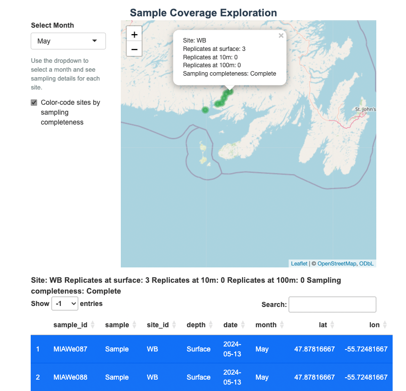

Sampling Quality Control
================

# Sampling Design Quality Control App

Welcome! This is an interactive application to assess the sampling
design and quality of field work being conducted for the CNFASAR project
taking place in the South Coast of Newfoundland.

There are two datasets used to build this app:

1.  *metadata_raw.rds:* This file contains the metadata for each
    individual environmental DNA (eDNA) sample taken. Within this file
    there is information about the sample ID (**sample_id**), whether
    the sample is a true biological sample or a control (**sample**),
    the site name (**site_id**), the depth that the sample was taken
    (**depth**) in meters, the date the sample was taken (**date**), the
    three letter abbreviation for the month the sample was taken
    (**month**), and the spatial coordinates, in decimal degrees, that
    the sample was taken (**lat** and **lon**).

2.  *sample_data.rds:* This file contains a summary of the replicates
    taken at each site during each month as well as an assessment of
    sampling completeness. Information includes site name (**site_id**),
    the three letter abbreviation for the month the sample was taken
    (**month**), the number of replicates at 10m (**replicates_10m**),
    the number of replicates at 100m (**replicates_100m**), the number
    of replicates at the surface (**Surface**), the spatial coordinates
    in decimal degrees (**lat** and **lon**), and the level of sampling
    completeness depending on the number of replicates
    (**sampling_completeness**) (note: best practices for eDNA sampling
    is triplicate sampling per sampling unit. The aim is to take 3
    samples per depth at each site, with one control sample per day of
    sampling to account for any possible contamination).

Access the app here: <https://alexschmill.shinyapps.io/sampling-qc/>

**Project Abstract**: Establishing effective Marine Protected Areas
(MPAs) requires a detailed understanding of marine biodiversity patterns
to guide conservation and management decisions. As marine ecosystems
face increasing pressures from climate change, overfishing, and habitat
degradation, baseline biodiversity information is essential for
designing areas that maximize ecological resilience and protection. Our
work focuses on Newfoundland’s south coast, a region under consideration
for a National Marine Conservation Area (NMCA), where environmental DNA
(eDNA) metabarcoding is being used to provide comprehensive and
non-invasive biodiversity assessments across spatial and temporal
scales. To enhance the utility of eDNA data, our study integrates eDNA
metabarcoding with dynamic species distribution models (DSDMs) to
address key uncertainties in species presence interpretation, such as
eDNA transport and persistence. By evaluating the relationship between
eDNA-derived indices and habitat suitability predictions, we aim to
improve the reliability of species occurrence data and provide insights
into critical habitats for vulnerable species. This research will not
only establish baseline biodiversity patterns but also directly inform
the planning and implementation of the proposed NMCA, ensuring that
conservation measures are grounded in robust scientific evidence and
tailored to the unique ecological dynamics of this region.

    
